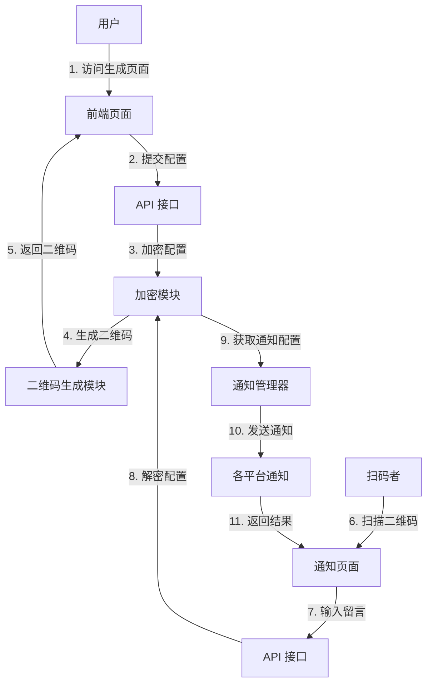

# 停车通知系统 Code Wiki

## 1. 项目概述

停车通知系统是一个通过二维码实现的停车通知系统，支持多种通知方式（钉钉、飞书、企业微信、邮件、短信）。当有人需要车主移车时，只需扫描车上的二维码即可发送通知。

### 主要功能
- 生成包含通知配置的加密二维码
- 扫码即可发送移车通知
- 支持多种通知方式（钉钉、飞书、企业微信、邮件、短信）
- 车主可自定义通知内容
- 扫码者可输入简短留言
- 彩色二维码样式
- 无需数据持久化，配置信息加密嵌入二维码
- 一键部署脚本
- 系统更新功能
- 故障排查协助功能

### 技术栈
- 后端：Python + Flask
- 前端：HTML5 + CSS3 + JavaScript
- 二维码生成：qrcode 库
- 加密：cryptography 库
- 通知集成：各平台 API

## 2. 项目架构

### 系统架构图



### 核心模块

1. **API 模块**：处理前端请求，包括生成二维码和发送通知
2. **加密模块**：使用 AES-256-GCM 加密算法保护配置信息
3. **二维码模块**：生成包含加密配置的二维码
4. **通知模块**：管理和发送各种类型的通知
5. **配置模块**：管理系统配置

## 3. 目录结构

```
├── README.md              # 项目说明文件
├── backend/              # 后端代码
│   ├── .env.example      # 环境变量示例
│   ├── app/              # 应用主目录
│   │   ├── api/          # API 模块
│   │   │   ├── __init__.py     # 初始化文件
│   │   │   ├── handlers.py     # API 处理函数
│   │   │   ├── routes.py       # API 路由
│   │   ├── config/        # 配置模块
│   │   │   ├── __init__.py     # 初始化文件
│   │   │   ├── settings.py     # 配置设置
│   │   ├── crypto/        # 加密模块
│   │   │   ├── __init__.py     # 初始化文件
│   │   │   ├── encryptor.py    # 加密实现
│   │   ├── notifiers/     # 通知模块
│   │   │   ├── __init__.py     # 初始化文件
│   │   │   ├── base.py         # 通知基类
│   │   │   ├── dingtalk.py     # 钉钉通知
│   │   │   ├── email.py        # 邮件通知
│   │   │   ├── feishu.py       # 飞书通知
│   │   │   ├── manager.py      # 通知管理器
│   │   │   ├── sms.py          # 短信通知
│   │   │   ├── wechat.py       # 企业微信通知
│   │   ├── qrcode/        # 二维码模块
│   │   │   ├── __init__.py     # 初始化文件
│   │   │   ├── generator.py    # 二维码生成
│   │   ├── __init__.py     # 初始化文件
│   ├── requirements.txt   # Python 依赖
│   └── run.py             # 应用启动入口
├── deploy.sh             # 一键部署脚本
├── update.sh             # 系统更新脚本
├── assist.sh             # 故障排查协助脚本
├── .gitignore            # Git 忽略文件
└── frontend/             # 前端代码
    ├── public/            # 静态资源
    │   └── css/           # 样式文件
    │       └── style.css  # 主样式文件
    └── templates/         # HTML 模板文件
        ├── index.html     # 生成二维码页面
        └── notify.html    # 发送通知页面
```

## 4. 核心模块详解

### 4.1 API 模块

**文件**：[handlers.py](file:///workspace/backend/app/api/handlers.py)

**功能**：处理前端请求，包括生成二维码和发送通知

**主要函数**：

1. **generate_qrcode()**
   - **功能**：生成包含通知配置的加密二维码
   - **请求参数**：
     - `notification_config`：通知配置，包含各种通知方式的配置
     - `message`：自定义通知内容
     - `qrcode_config`：二维码配置，包括颜色等
   - **返回值**：包含生成的二维码图片（base64 编码）的 JSON 响应

2. **send_notification()**
   - **功能**：发送移车通知
   - **请求参数**：
     - `encrypted_data`：加密的配置数据
     - `message`：扫码者输入的留言
   - **返回值**：包含通知发送结果的 JSON 响应

3. **health_check()**
   - **功能**：健康检查接口
   - **返回值**：包含服务状态的 JSON 响应

**文件**：[routes.py](file:///workspace/backend/app/api/routes.py)

**功能**：定义 API 路由

**路由**：
- `/api/generate`：生成二维码
- `/api/notify`：发送通知
- `/api/health`：健康检查

### 4.2 加密模块

**文件**：[encryptor.py](file:///workspace/backend/app/crypto/encryptor.py)

**功能**：使用 AES-256-GCM 加密算法加密和解密配置信息

**主要类**：

**Encryptor**
- **初始化**：`__init__(self, key=None)` - 初始化加密器，使用配置中的密钥或提供的密钥
- **方法**：
  - `encrypt(self, data)` - 加密数据，返回 base64 编码的字符串
  - `decrypt(self, encrypted_data)` - 解密数据，返回解密后的字典

### 4.3 二维码模块

**文件**：[generator.py](file:///workspace/backend/app/qrcode/generator.py)

**功能**：生成包含加密配置的二维码

**主要类**：

**QRCodeGenerator**
- **方法**：
  - `generate(self, data, color="#000000", background="#FFFFFF", size=10)` - 生成二维码，返回 base64 编码的图片数据

### 4.4 通知模块

**文件**：[manager.py](file:///workspace/backend/app/notifiers/manager.py)

**功能**：管理和协调各种通知方式

**主要类**：

**NotifierManager**
- **初始化**：`__init__(self)` - 初始化通知管理器，注册各种通知器
- **方法**：
  - `send_notification(self, notification_config, message)` - 发送通知，返回各通知方式的发送结果

**文件**：[base.py](file:///workspace/backend/app/notifiers/base.py)

**功能**：定义通知基类

**主要类**：

**BaseNotifier**（抽象类）
- **方法**：
  - `send(self, message, **kwargs)` - 发送通知的抽象方法，子类必须实现

**具体通知实现**：
- **DingTalkNotifier**：钉钉通知
- **FeishuNotifier**：飞书通知
- **WeChatNotifier**：企业微信通知
- **EmailNotifier**：邮件通知
- **SMSNotifier**：短信通知

### 4.5 配置模块

**文件**：[settings.py](file:///workspace/backend/app/config/settings.py)

**功能**：管理系统配置，从环境变量中读取配置信息

**主要类**：

**Config**
- **属性**：
  - `SECRET_KEY`：用于加密的密钥
  - `PORT`：服务端口
  - `DEBUG`：调试模式
  - 邮件相关配置：`SMTP_SERVER`、`SMTP_PORT`、`SMTP_USERNAME`、`SMTP_PASSWORD`、`SMTP_SENDER`
  - 短信相关配置：`SMS_API_KEY`、`SMS_API_URL`、`SMS_SIGNATURE`

## 5. 核心流程

### 5.1 生成二维码流程

1. 用户访问前端生成二维码页面
2. 填写通知配置（至少选择一种通知方式）
3. 自定义通知内容（可选）
4. 设置二维码颜色（可选）
5. 点击「生成二维码」按钮
6. 前端发送请求到 `/api/generate` 接口
7. 后端加密配置信息
8. 生成包含加密信息的二维码
9. 返回二维码图片给前端
10. 用户下载并打印二维码

### 5.2 发送通知流程

1. 扫码者扫描车上的二维码
2. 打开通知页面
3. 输入留言（可选）
4. 点击「发送通知」按钮
5. 前端发送请求到 `/api/notify` 接口
6. 后端解密配置信息
7. 提取通知配置和通知内容
8. 通过通知管理器发送通知
9. 返回发送结果给前端

## 6. 依赖关系

| 依赖项 | 用途 | 来源 |
| ------ | ---- | ---- |
| Flask | Web 框架 | [requirements.txt](file:///workspace/backend/requirements.txt) |
| Flask-CORS | 处理跨域请求 | [requirements.txt](file:///workspace/backend/requirements.txt) |
| qrcode | 生成二维码 | [requirements.txt](file:///workspace/backend/requirements.txt) |
| cryptography | 加密功能 | [requirements.txt](file:///workspace/backend/requirements.txt) |
| requests | HTTP 请求 | [requirements.txt](file:///workspace/backend/requirements.txt) |
| python-dotenv | 环境变量管理 | [requirements.txt](file:///workspace/backend/requirements.txt) |

## 7. 环境变量配置

系统使用 `.env` 文件存储环境变量，主要配置项如下：

| 配置项 | 描述 | 默认值 | 必须 |
| ------ | ---- | ------ | ---- |
| `SECRET_KEY` | 用于加密配置信息的密钥 | 无 | 是 |
| `SMTP_SERVER` | 邮件服务器地址 | 无 | 邮件通知时需要 |
| `SMTP_PORT` | 邮件服务器端口 | 无 | 邮件通知时需要 |
| `SMTP_USERNAME` | 邮件服务器用户名 | 无 | 邮件通知时需要 |
| `SMTP_PASSWORD` | 邮件服务器密码 | 无 | 邮件通知时需要 |
| `SMTP_SENDER` | 发件人邮箱 | 无 | 邮件通知时需要 |
| `SMS_API_KEY` | 短信 API 密钥 | 无 | 短信通知时需要 |
| `SMS_API_URL` | 短信 API 地址 | 无 | 短信通知时需要 |
| `SMS_SIGNATURE` | 短信签名 | 无 | 短信通知时需要 |

## 8. 部署与运行

### 8.1 一键部署（推荐）

1. 克隆仓库
   ```bash
   git clone https://github.com/gituib/car_notice.git
   cd car_notice
   ```

2. 运行部署脚本
   ```bash
   chmod +x deploy.sh
   ./deploy.sh
   ```

3. 按照提示完成部署

部署脚本会自动完成以下操作：
- 安装必要的依赖（Nginx、Python 3、pip、python3-venv）
- 创建并激活虚拟环境
- 安装Python依赖
- 配置环境变量（生成随机SECRET_KEY）
- 配置Nginx反向代理
- 部署前端静态文件
- 创建并启动systemd服务
- 检查服务状态

### 8.2 手动部署

#### 1. 后端安装

1. 进入后端目录
   ```bash
   cd backend
   ```

2. 创建并激活虚拟环境
   ```bash
   python3 -m venv venv
   source venv/bin/activate
   ```

3. 安装依赖
   ```bash
   pip install -r requirements.txt
   ```

4. 配置环境变量
   ```bash
   cp .env.example .env
   # 编辑 .env 文件，设置 SECRET_KEY 等配置
   # 建议使用 openssl rand -hex 32 生成随机 SECRET_KEY
   ```

5. 启动后端服务
   ```bash
   python run.py
   ```

#### 2. 前端部署

前端文件可以部署在任何静态文件服务器上，例如：
- Nginx
- Apache
- GitHub Pages
- Netlify

##### Nginx 配置示例

```nginx
server {
    listen 80;
    server_name localhost;

    # 前端静态文件
    location / {
        root /path/to/frontend;
        index index.html;
        try_files $uri $uri/ =404;
    }

    # 后端 API 代理
    location /api {
        proxy_pass http://localhost:5000;
        proxy_set_header Host $host;
        proxy_set_header X-Real-IP $remote_addr;
        proxy_set_header X-Forwarded-For $proxy_add_x_forwarded_for;
        proxy_set_header X-Forwarded-Proto $scheme;
    }
}
```

## 9. 系统维护

### 9.1 更新系统

```bash
./update.sh
```

该脚本会执行以下操作：
- 拉取最新代码
- 更新Python依赖
- 重启Nginx服务
- 重启后端服务
- 检查服务状态

### 9.2 故障排查

```bash
./assist.sh
```

该脚本提供以下功能：
- 检查服务状态
- 查看后端日志
- 查看Nginx日志
- 检查端口占用
- 测试健康检查接口
- 重启服务

### 9.3 健康检查

系统提供健康检查接口，可用于监控服务状态：

```bash
curl http://localhost/api/health
```

## 10. 安全说明

- 使用 AES-256-GCM 加密算法保护配置信息
- 密钥存储在环境变量中，不硬编码
- 不存储任何车主信息
- 通知内容加密传输

## 11. 未来扩展

- 支持更多通知方式（如微信小程序、电话通知等）
- 增加通知历史记录功能
- 实现多语言支持
- 添加验证码防止滥用

## 12. 许可证

MIT License

## 13. 快速开始

### 生成二维码
1. 访问前端生成二维码页面（默认为 `http://localhost`）
2. 填写通知配置（至少选择一种通知方式）
3. 自定义通知内容（可选）
4. 设置二维码颜色（可选）
5. 点击「生成二维码」按钮
6. 下载生成的二维码并打印贴在车上

### 发送通知
1. 扫描车上的二维码
2. 在打开的页面中输入留言（可选）
3. 点击「发送通知」按钮
4. 系统会通过配置的所有方式发送通知给车主

## 14. 常见问题

### 14.1 二维码无法生成
- 检查通知配置是否正确
- 确保至少选择了一种通知方式
- 查看后端日志了解具体错误

### 14.2 通知发送失败
- 检查通知配置是否正确（如 Webhook URL、邮箱地址等）
- 确保相关服务（如邮件服务器）配置正确
- 查看后端日志了解具体错误

### 14.3 服务无法启动
- 检查端口是否被占用
- 确保环境变量配置正确
- 查看后端日志了解具体错误

## 15. 技术支持

如需技术支持，请在 GitHub 仓库提交 Issue 或联系项目维护者。