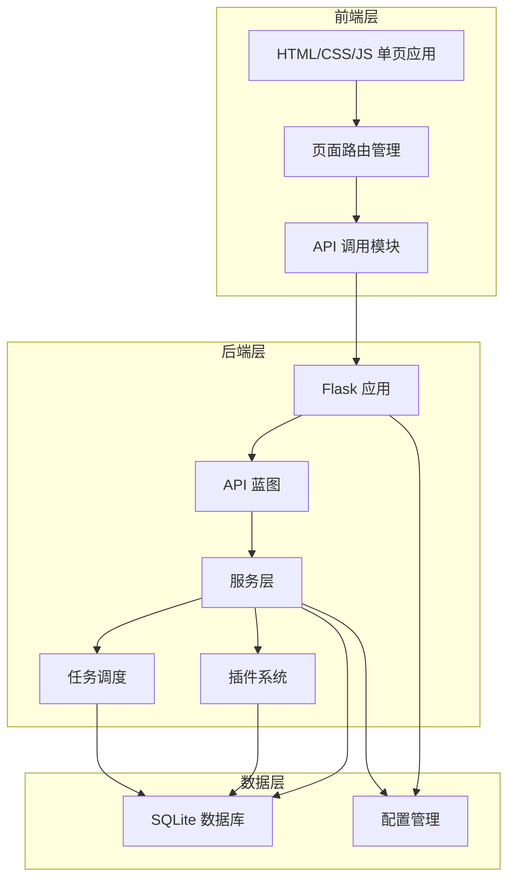

# T3MT 项目 Code Wiki

## 1. 项目概述

T3MT (Transfer & Task Management Tool) 是一个免费的影视管理助手，提供夸克网盘全自动下载、腾讯、爱奇艺、芒果、优酷等影视资源的全自动更新下载功能。

### 1.1 项目版本
- **社区版**：v3.0.7（已冻结，不再接受新功能）
- **专业版**：v3.1.x+（持续开发中，仅通过Docker镜像发布）

### 1.2 核心功能
- ✅ 夸克网盘转存
- ✅ 天翼云盘转存
- ✅ 影视解析下载
- ✅ 批量任务管理
- ✅ 定时任务调度
- ✅ 多账号管理
- ✅ 插件系统

## 2. 项目架构

T3MT 采用前后端分离的架构设计，后端使用 Python Flask 框架提供 API 服务，前端使用 HTML、CSS 和 JavaScript 实现单页应用。

### 2.1 架构图



### 2.2 目录结构

```
├── backend/              # 后端代码
│   ├── api/              # API 蓝图
│   ├── app.py            # Flask 应用主文件
│   ├── config.py         # 配置管理
│   ├── database.py       # 数据库管理
│   ├── models/           # 数据模型
│   ├── plugins/          # 插件目录
│   ├── services/         # 服务层
│   ├── tasks/            # 任务模块
│   └── utils/            # 工具函数
├── frontend/             # 前端代码
│   ├── components/       # 前端组件
│   ├── css/              # 样式文件
│   ├── index.html        # 主页面
│   ├── js/               # JavaScript 文件
│   └── pages/            # 页面模板
├── Dockerfile            # Docker 构建文件
├── docker-compose.yml    # Docker -compose 配置
└── README.md             # 项目说明
```

## 3. 核心模块

### 3.1 后端模块

#### 3.1.1 应用入口 (app.py)

应用的主入口文件，负责初始化 Flask 应用、注册 API 蓝图、启动服务等。

**主要功能**：
- 创建 Flask 应用实例
- 注册所有 API 蓝图
- 配置 CORS 跨域支持
- 初始化数据库
- 启动任务调度服务
- 启动 Aria2 下载服务
- 管理插件系统

**核心代码**：
- `create_app()`: 创建并配置 Flask 应用
- `main()`: 应用主函数，处理服务启动流程

#### 3.1.2 配置管理 (config.py)

负责管理应用配置，包括服务器设置、数据库配置、下载配置等。

**主要功能**：
- 读取和解析配置文件
- 管理夸克 API 配置
- 管理天翼云盘 API 配置
- 提供全局配置访问

**核心配置**：
- 服务器配置（主机、端口、调试模式）
- 数据库配置
- 下载配置（并发数、块大小、超时设置）
- 多线程下载配置

#### 3.1.3 数据库管理 (database.py)

负责数据库的初始化、连接管理和表结构定义。

**主要功能**：
- 初始化数据库表结构
- 提供数据库连接管理
- 处理数据库迁移
- 定义数据模型

**核心表结构**：
- users: 用户表
- quark_accounts: 云盘账号表
- transfer_tasks: 转存任务表
- download_tasks: 下载任务表
- video_tasks: 影视下载任务表
- task_execution_history: 任务执行历史表
- regex_rules: 正则规则表
- log_records: 日志表

#### 3.1.4 API 模块 (api/)

提供 RESTful API 接口，处理前端请求。

**主要蓝图**：
- auth_bp: 认证相关 API
- accounts_bp: 账号管理 API
- quark_bp: 夸克网盘相关 API
- search_bp: 资源搜索 API
- transfer_bp: 转存任务 API
- download_bp: 下载任务 API
- video_bp: 影视下载 API
- files_bp: 文件管理 API
- regex_rules_bp: 正则规则 API
- monitor_bp: 监控 API
- video_ranking_bp: 影视排行榜 API
- license_bp: 许可证 API
- upgrade_bp: 升级管理 API
- plugins_bp: 插件管理 API
- download_proxy_bp: 下载代理 API

#### 3.1.5 服务层 (services/)

实现核心业务逻辑，包括任务调度、插件管理、Aria2 管理等。

**主要服务**：
- SchedulerService: 任务调度服务
- PluginManager: 插件管理服务
- aria2_manager: Aria2 下载管理
- license_manager: 许可证管理

#### 3.1.6 任务模块 (tasks/)

处理各种任务的执行逻辑，包括转存任务、下载任务、影视下载任务等。

#### 3.1.7 工具模块 (utils/)

提供通用工具函数，如日志管理、配置加密、网络请求等。

### 3.2 前端模块

#### 3.2.1 主页面 (index.html)

前端应用的主页面，实现了单页应用的布局和导航。

**主要功能**：
- 侧边栏导航
- 页面路由管理
- 模态框管理
- 用户信息展示

#### 3.2.2 页面组件 (pages/)

包含各个功能页面的 HTML 模板。

**主要页面**：
- 资源搜索页
- 我的云盘页
- 定时转存页
- 定时下载页
- 影视下载页
- 调度监控页
- 插件管理页
- 系统配置页

#### 3.2.3 JavaScript 模块 (js/)

实现前端交互逻辑，包括 API 调用、页面渲染、事件处理等。

## 4. 核心功能实现

### 4.1 夸克网盘转存

**功能描述**：将分享链接中的文件转存到夸克网盘中。

**实现流程**：
1. 解析分享链接
2. 获取分享文件列表
3. 选择目标云盘账号和路径
4. 执行转存操作
5. 记录转存历史

**关键 API**：
- `/api/quark/transfer` - 执行转存操作
- `/api/quark/list` - 列出云盘文件
- `/api/quark/mkdir` - 创建目录

### 4.2 天翼云盘转存

**功能描述**：将文件转存到天翼云盘中。

**实现流程**：
1. 认证天翼云盘账号
2. 解析分享链接
3. 获取分享文件列表
4. 选择目标路径
5. 执行转存操作

**关键 API**：
- `/api/cloud189/transfer` - 执行转存操作
- `/api/cloud189/list` - 列出云盘文件

### 4.3 影视解析下载

**功能描述**：解析影视网站的视频资源并下载到本地或云盘。

**实现流程**：
1. 解析影视网站 URL
2. 获取视频信息和剧集列表
3. 选择要下载的剧集
4. 解析视频播放链接
5. 执行下载操作

**关键 API**：
- `/api/video/parse` - 解析影视信息
- `/api/video/download` - 下载影视资源
- `/api/video/tasks` - 管理影视下载任务

### 4.4 定时任务调度

**功能描述**：根据设定的 cron 表达式定时执行任务。

**实现流程**：
1. 创建定时任务（转存、下载或影视下载）
2. 设置 cron 表达式
3. 任务调度服务定期检查并执行任务
4. 记录任务执行历史

**关键组件**：
- SchedulerService: 任务调度服务
- task_execution_history: 任务执行历史表

### 4.5 多账号管理

**功能描述**：管理多个云盘账号，支持设置主账号。

**实现流程**：
1. 添加云盘账号（夸克、天翼云）
2. 验证账号有效性
3. 设置主账号
4. 管理账号状态

**关键 API**：
- `/api/accounts/add` - 添加账号
- `/api/accounts/list` - 列出账号
- `/api/accounts/set-main` - 设置主账号

### 4.6 插件系统

**功能描述**：支持通过插件扩展系统功能。

**实现流程**：
1. 扫描本地插件目录
2. 加载插件
3. 管理插件状态（启动/停止）
4. 执行插件逻辑

**关键 API**：
- `/api/plugins/list` - 列出插件
- `/api/plugins/start` - 启动插件
- `/api/plugins/stop` - 停止插件

## 5. 技术栈

| 分类 | 技术/框架 | 用途 |
|------|-----------|------|
| 后端 | Python 3 | 主要开发语言 |
|      | Flask | Web 框架 |
|      | SQLite | 本地数据库 |
|      | Aria2 | 下载管理 |
| 前端 | HTML5 | 页面结构 |
|      | CSS3 | 样式设计 |
|      | JavaScript | 交互逻辑 |
|      | Bootstrap | UI 组件 |
| 部署 | Docker | 容器化部署 |
|      | Docker Compose | 多容器管理 |

## 6. 部署方式

### 6.1 Docker 部署（推荐）

```bash
# 拉取最新镜像
docker pull 85423296/t3mt:latest

# 下载配置文件
wget https://raw.githubusercontent.com/qq85423296/t3mt/main/docker-compose.yml

# 启动服务
docker-compose up -d

# 访问
http://localhost:8520
```

### 6.2 从源码构建

```bash
# 克隆仓库
git clone https://github.com/qq85423296/t3mt.git
cd t3mt

# 构建镜像
docker build -t t3mt:community .

# 运行
docker-compose up -d
```

## 7. 核心 API 参考

### 7.1 认证 API

| API 路径 | 方法 | 功能描述 |
|---------|------|----------|
| `/api/auth/login` | POST | 用户登录 |
| `/api/auth/logout` | GET | 用户登出 |
| `/api/auth/change-password` | POST | 修改密码 |

### 7.2 账号管理 API

| API 路径 | 方法 | 功能描述 |
|---------|------|----------|
| `/api/accounts/list` | GET | 获取账号列表 |
| `/api/accounts/add` | POST | 添加账号 |
| `/api/accounts/update` | PUT | 更新账号 |
| `/api/accounts/delete` | DELETE | 删除账号 |
| `/api/accounts/set-main` | POST | 设置主账号 |

### 7.3 夸克网盘 API

| API 路径 | 方法 | 功能描述 |
|---------|------|----------|
| `/api/quark/list` | GET | 列出文件 |
| `/api/quark/mkdir` | POST | 创建目录 |
| `/api/quark/transfer` | POST | 执行转存 |
| `/api/quark/get-info` | GET | 获取账号信息 |

### 7.4 影视下载 API

| API 路径 | 方法 | 功能描述 |
|---------|------|----------|
| `/api/video/parse` | POST | 解析影视信息 |
| `/api/video/download` | POST | 下载影视资源 |
| `/api/video/tasks` | GET | 获取任务列表 |
| `/api/video/tasks/add` | POST | 添加任务 |
| `/api/video/tasks/update` | PUT | 更新任务 |
| `/api/video/tasks/delete` | DELETE | 删除任务 |

### 7.5 任务管理 API

| API 路径 | 方法 | 功能描述 |
|---------|------|----------|
| `/api/transfer/tasks` | GET | 获取转存任务列表 |
| `/api/transfer/tasks/add` | POST | 添加转存任务 |
| `/api/transfer/tasks/update` | PUT | 更新转存任务 |
| `/api/transfer/tasks/delete` | DELETE | 删除转存任务 |
| `/api/download/tasks` | GET | 获取下载任务列表 |
| `/api/download/tasks/add` | POST | 添加下载任务 |
| `/api/download/tasks/update` | PUT | 更新下载任务 |
| `/api/download/tasks/delete` | DELETE | 删除下载任务 |

### 7.6 插件管理 API

| API 路径 | 方法 | 功能描述 |
|---------|------|----------|
| `/api/plugins/list` | GET | 获取插件列表 |
| `/api/plugins/start` | POST | 启动插件 |
| `/api/plugins/stop` | POST | 停止插件 |
| `/api/plugins/reload` | POST | 重新加载插件 |

## 8. 数据库结构

### 8.1 用户表 (users)

| 字段名 | 类型 | 描述 |
|-------|------|------|
| id | INTEGER | 用户ID |
| username | VARCHAR(50) | 用户名 |
| password | VARCHAR(255) | 密码 |
| created_at | DATETIME | 创建时间 |

### 8.2 云盘账号表 (quark_accounts)

| 字段名 | 类型 | 描述 |
|-------|------|------|
| id | INTEGER | 账号ID |
| remark | VARCHAR(100) | 账号备注 |
| cookie | TEXT | 账号Cookie |
| account_name | VARCHAR(50) | 账号名称 |
| is_vip | TINYINT | 是否VIP |
| member_type | VARCHAR(20) | 会员类型 |
| member_exp_at | VARCHAR(20) | 会员过期时间 |
| total_size | BIGINT | 总空间大小 |
| used_size | BIGINT | 已用空间大小 |
| is_main | TINYINT | 是否主账号 |
| status | TINYINT | 账号状态 |
| cloud_type | VARCHAR(20) | 云盘类型 |
| created_at | DATETIME | 创建时间 |
| updated_at | DATETIME | 更新时间 |

### 8.3 转存任务表 (transfer_tasks)

| 字段名 | 类型 | 描述 |
|-------|------|------|
| id | INTEGER | 任务ID |
| name | VARCHAR(200) | 任务名称 |
| share_urls | TEXT | 分享链接 |
| target_account_id | INTEGER | 目标账号ID |
| target_path | VARCHAR(500) | 目标路径 |
| save_mode | VARCHAR(20) | 保存模式 |
| target_folder_name | VARCHAR(200) | 目标文件夹名称 |
| rules | TEXT | 规则 |
| filter_extensions | TEXT | 过滤扩展名 |
| include_extensions | TEXT | 包含扩展名 |
| update_dirs | TEXT | 更新目录 |
| file_start_date | DATE | 文件开始日期 |
| overwrite_mode | TINYINT | 覆盖模式 |
| end_date | DATE | 结束日期 |
| cron_expression | VARCHAR(50) |  cron 表达式 |
| schedule_period | VARCHAR(20) | 调度周期 |
| status | VARCHAR(20) | 任务状态 |
| last_execute_time | DATETIME | 上次执行时间 |
| next_execute_time | DATETIME | 下次执行时间 |
| regex_pattern | TEXT | 正则模式 |
| replacement_pattern | TEXT | 替换模式 |
| check_mode | VARCHAR(20) | 检查模式 |
| cloud_type | VARCHAR(20) | 云盘类型 |
| created_at | DATETIME | 创建时间 |
| updated_at | DATETIME | 更新时间 |

### 8.4 下载任务表 (download_tasks)

| 字段名 | 类型 | 描述 |
|-------|------|------|
| id | INTEGER | 任务ID |
| name | VARCHAR(200) | 任务名称 |
| source_account_id | INTEGER | 源账号ID |
| source_path | VARCHAR(500) | 源路径 |
| target_path | VARCHAR(500) | 目标路径 |
| cron_expression | VARCHAR(50) |  cron 表达式 |
| filter_extensions | TEXT | 过滤扩展名 |
| include_extensions | TEXT | 包含扩展名 |
| only_new_files | TINYINT | 仅下载新文件 |
| keep_structure | TINYINT | 保持目录结构 |
| delete_after_download | TINYINT | 下载后删除 |
| regex_pattern | TEXT | 正则模式 |
| replacement_pattern | TEXT | 替换模式 |
| status | VARCHAR(20) | 任务状态 |
| progress | INTEGER | 进度 |
| last_execute_time | DATETIME | 上次执行时间 |
| next_execute_time | DATETIME | 下次执行时间 |
| cloud_type | VARCHAR(20) | 云盘类型 |
| created_at | DATETIME | 创建时间 |
| updated_at | DATETIME | 更新时间 |

### 8.5 影视下载任务表 (video_tasks)

| 字段名 | 类型 | 描述 |
|-------|------|------|
| id | INTEGER | 任务ID |
| name | VARCHAR(200) | 任务名称 |
| website_url | VARCHAR(500) | 网站URL |
| video_id | VARCHAR(50) | 视频ID |
| clip_id | VARCHAR(50) | 剧集ID |
| save_directory | VARCHAR(500) | 保存目录 |
| cron_expression | VARCHAR(100) |  cron 表达式 |
| episodes_json | TEXT | 剧集JSON |
| video_info_json | TEXT | 视频信息JSON |
| status | VARCHAR(20) | 任务状态 |
| progress | INTEGER | 进度 |
| downloaded_episodes | INTEGER | 已下载剧集数 |
| create_subfolder | INTEGER | 创建子文件夹 |
| selected_episodes | TEXT | 选择的剧集 |
| last_downloaded_episode | INTEGER | 上次下载的剧集 |
| platform | VARCHAR(20) | 平台 |
| video_type | VARCHAR(20) | 视频类型 |
| cloud_type | VARCHAR(20) | 云盘类型 |
| created_at | TIMESTAMP | 创建时间 |
| updated_at | TIMESTAMP | 更新时间 |

## 9. 配置管理

### 9.1 配置文件 (config.ini)

```ini
[app]
host = 0.0.0.0
port = 8520
debug = false

[license_server]
url = aHR0cDovL2xpY2Vuc2UuMjJsMi5jb20=
```

### 9.2 环境变量

| 环境变量 | 描述 | 默认值 |
|---------|------|--------|
| HOST | 服务器主机 | 0.0.0.0 |
| PORT | 服务器端口 | 8520 |
| DEBUG | 调试模式 | false |

## 10. 常见问题与解决方案

### 10.1 天翼云下载卡住

**问题**：天翼云盘下载任务卡住，无法完成。

**解决方案**：系统已实现卡住检测与自动重试机制，会在检测到下载卡顿时自动重试。

### 10.2 夸克API配置问题

**问题**：夸克API配置未加载，导致转存功能无法使用。

**解决方案**：确保已正确配置夸克API参数，可联系管理员获取配置。

### 10.3 任务执行失败

**问题**：定时任务执行失败，状态显示错误。

**解决方案**：检查任务配置是否正确，查看任务执行日志获取详细错误信息。

### 10.4 插件加载失败

**问题**：插件无法加载或启动失败。

**解决方案**：检查插件文件是否完整，查看系统日志获取详细错误信息。

## 11. 开发与贡献

### 11.1 开发环境搭建

1. 克隆仓库：`git clone https://github.com/qq85423296/t3mt.git`
2. 安装依赖：`pip install -r backend/requirements.txt`
3. 启动服务：`python backend/start.py`

### 11.2 贡献指南

社区版不再接受新功能PR，但欢迎：
- 🐛 Bug修复
- 📝 文档改进
- 🌍 国际化翻译

## 12. 版本历史

| 版本 | 发布日期 | 主要变更 |
|------|---------|----------|
| v3.0.7 | 2026-02-06 | 影视解析第三方资源开关、天翼云下载卡住检测与自动重试、优化的任务执行器、完善的错误处理机制 |
| v3.1.x+ | 持续更新 | 专业版，包含高级功能和定期更新 |

## 13. 联系方式

- GitHub Issues: https://github.com/qq85423296/t3mt/issues
- Docker Hub: https://hub.docker.com/r/85423296/t3mt
- QQ群: 630966420（问题反馈、经验分享）

## 14. 许可证

MIT License

---

**最后更新**: 2026-04-16
**社区版版本**: v3.0.7
**专业版版本**: v3.1.x+
